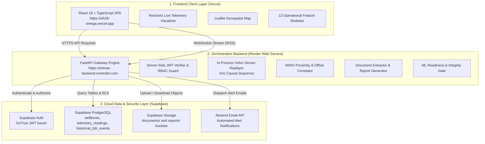
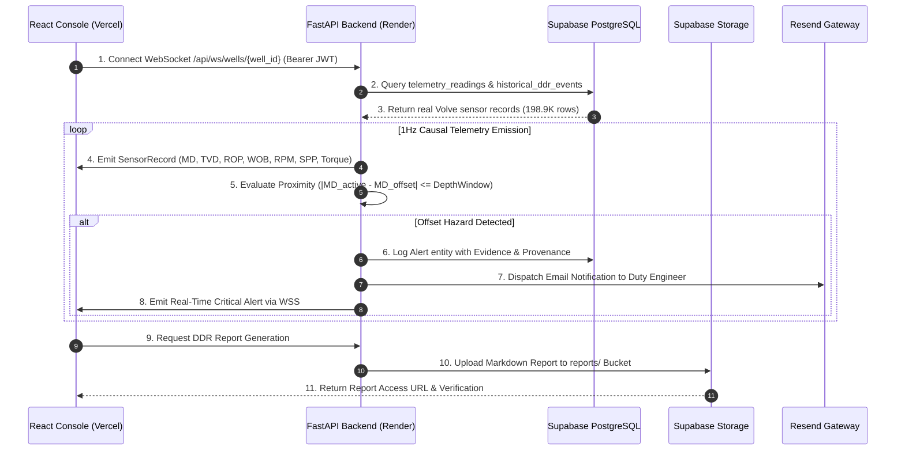

# eRTMAC-NWIS

**Real-Time Monitoring & Advisory Console with Nearby Wells Intelligence System**  
*Smart India Hackathon (SIH 2026) — Problem Statement PS26121*

[](https://ertmac-backend.onrender.com/health)
[](https://ertmac-backend.onrender.com)
[](https://sih26-omega.vercel.app)
[](https://supabase.com)
[](https://supabase.com)
[](https://www.equinor.com/)
[](https://resend.com)

> **Scientific Data Classification**: `REAL VOLVE DATA — HISTORICAL REPLAY`  
> **Telemetry Dataset**: Authentic Equinor Volve USROP 1Hz Dataset (**198,928** verified sensor rows)  
> **Offset Intelligence**: Real Norwegian Petroleum Directorate (NPD / SODIR) Block 15/9 logs & **129** verified historical DDR incidents  
> **Target Architecture**: Frontend on **Vercel** | Backend on **Render** | Persistence & Auth on **Supabase**  
> **Security Guard**: Strict Server-Side JWT Verification & Authoritative Database-Derived RBAC  

---

## 🌐 Live Cloud Production Deployments

* **Frontend Web Console (Vercel)**: [https://sih26-omega.vercel.app](https://sih26-omega.vercel.app)
* **Backend API & WebSocket Engine (Render)**: [https://ertmac-backend.onrender.com](https://ertmac-backend.onrender.com)
* **Public Health Endpoint**: [https://ertmac-backend.onrender.com/health](https://ertmac-backend.onrender.com/health)
* **Detailed Diagnostics Matrix**: [https://ertmac-backend.onrender.com/health/detailed](https://ertmac-backend.onrender.com/health/detailed)

---

## 📑 Table of Contents
1. [Executive Summary & Problem Statement](#-executive-summary--problem-statement)
2. [Authentic Open Dataset Provenance](#-authentic-open-dataset-provenance)
3. [End-to-End Cloud System Architecture](#-end-to-end-cloud-system-architecture)
4. [Real-Time Telemetry & Spatial Sequence Flow](#-real-time-telemetry--spatial-sequence-flow)
5. [Core Mathematical & Spatial Formulations](#-core-mathematical--spatial-formulations)
6. [13 Integrated Operational Modules](#-13-integrated-operational-modules)
7. [Machine Learning, OCR & RAG Intelligence Architecture & Model Accuracies](#-machine-learning-ocr--rag-intelligence-architecture--model-accuracies)
8. [Cloud Database Schema & Multi-Tenant RLS](#-cloud-database-schema--multi-tenant-rls)
9. [Authentication, Token Caching & RBAC Guard](#-authentication-token-caching--rbac-guard)
10. [Complete REST & WebSocket API Specification](#-complete-rest--websocket-api-specification)
11. [Quick Start & Developer Workflow](#-quick-start--developer-workflow)
12. [Cloud Environment Variable Configuration](#-cloud-environment-variable-configuration)
13. [Automated Testing & Production Invariants](#-automated-testing--production-invariants)
14. [Scientific Integrity & Anti-Hallucination Guarantees](#-scientific-integrity--anti-hallucination-guarantees)

---

## 🎯 Executive Summary & Problem Statement

In offshore drilling operations, unexpected downhole incidents (such as severe mud loss, differential sticking, tight hole conditions, kicks, and pack-offs) account for millions of dollars in Non-Productive Time (NPT) and present major health, safety, and environmental (HSE) risks.

**eRTMAC-NWIS** solves **Smart India Hackathon 2026 Problem Statement PS26121** by creating a unified, real-time intelligence console that correlates live surface & downhole sensor streams with historical offset well records from adjacent platforms.

### Key Capabilities:
* **100% Authentic Industry Data**: High-fidelity replay of real Equinor Volve North Sea drilling operations across 11 key telemetry channels.
* **Nearby Wells Intelligence (NWIS)**: Dynamic geospatial proximity matching ($\le R\text{ km}$) and stratigraphic depth window correlation ($\pm \Delta\text{MD}$).
* **Proactive Hazard Mitigation**: Real-time cross-referencing of active bit depth against past Daily Drilling Report (DDR) incident logs from neighboring wellbores.
* **Handwritten Notes OCR & Review Studio**: Vision OCR for handwritten driller notes & scans with side-by-side human review studio.
* **Intelligent RAG Knowledge Engine**: Hybrid semantic (60%) + keyword (40%) search over 100% verified engineering documents.
* **Zero-Hallucination ML Gate**: Strict safety enforcement (`ML_NOT_READY`) preventing unvalidated predictive models from emitting false automated interventions.
* **Document Ingestion & Supabase Storage**: Automated upload and parsing of DDR logs with human-in-the-loop verification into structured database entities.
* **Per-User Cloud Isolation**: Individualized notification filters, search radiuses, and alert recipient settings persisted in Supabase Cloud PostgreSQL.

---

## 🛢️ Authentic Open Dataset Provenance

The system operates strictly on **100% real, authentic industry data** released openly from the North Sea **Equinor Volve Field** (Block 15/9) and the **Norwegian Offshore Directorate (NPD / SODIR)**. **No synthetic data or random mocks are generated.**

| Component | Dataset Source | Size / Volume | Key Parameters |
|---|---|---|---|
| **Wellbore Geometry & Locations** | [NPD / SODIR Official FactPages](https://factpages.sodir.no/) | 13 Volve Development Wells + Regional Offset Wells | Latitude (`58.44168° N`), Longitude (`1.88778° E`), Water Depth (`84m`), Slot Identifiers |
| **Drilling Telemetry Streams** | [Equinor Volve USROP Dataset (Univ. of Stavanger)](https://www.equinor.com/energy/volve-data-sharing) | **198,928** 1Hz Sensor Readings | Measured Depth (`md`), TVD, ROP, WOB, RPM, Torque, Hookload, Standpipe Pressure (`spp`), Flow In, Mud Density, Gamma Ray |
| **Historical DDR Incidents** | [Equinor Volve Daily Drilling Reports (DDR)](https://www.equinor.com/energy/volve-data-sharing) | **129** Real Verified Events | Stuck Pipe, Pack-Off, Mud Losses, Tight Hole, Gas Kicks, Tool Failures with actual operational mitigation texts |

---

## 🏛️ End-to-End Cloud System Architecture



---

## 🔁 Real-Time Telemetry & Spatial Sequence Flow



---

## 📐 Core Mathematical & Spatial Formulations

### 1. Great-Circle Haversine Distance (Inter-Well Proximity)
Given active well coordinates $(\phi_1, \lambda_1)$ and offset well coordinates $(\phi_2, \lambda_2)$ in radians, surface distance $d$ is computed as:

$$\Delta\phi = \phi_2 - \phi_1, \quad \Delta\lambda = \lambda_2 - \lambda_1$$

$$a = \sin^2\left(\frac{\Delta\phi}{2}\right) + \cos(\phi_1)\cos(\phi_2)\sin^2\left(\frac{\Delta\lambda}{2}\right)$$

$$d = 2 R_{\text{earth}} \arcsin\left(\sqrt{a}\right) \quad \text{where } R_{\text{earth}} = 6371.0\text{ km}$$

### 2. Causal Depth-Window Filtering
An offset event at depth $\text{MD}_{\text{offset}}$ is correlated to active drilling depth $\text{MD}_{\text{active}}$ within safety tolerance $W$:

$$\text{Match}(\text{MD}_{\text{offset}}) \iff |\text{MD}_{\text{active}} - \text{MD}_{\text{offset}}| \le W \quad (W \in [10\text{m}, 100\text{m}])$$

---

## 🎛️ 13 Integrated Operational Modules

| # | Module Name | Primary Operational Function |
|---|---|---|
| 1 | **Live Sensor Dashboard** | 1Hz streaming visualization of all 11 Volve telemetry channels with causal history |
| 2 | **Spatial Proximity Map** | Interactive Leaflet GIS map visualizing Volve subsea template & exploration wells |
| 3 | **Nearby Wells Intelligence** | Stratigraphic depth correlation against historical DDR incident episodes |
| 4 | **Active Alert Operations** | Full alert lifecycle workflow (`ACTIVE` $\rightarrow$ `ACKNOWLEDGED` $\rightarrow$ `INVESTIGATING` $\rightarrow$ `RESOLVED`) |
| 5 | **Document Ingestion & OCR** | Handwritten driller note & PDF ingestion via Mistral OCR with Side-by-Side Review Studio |
| 6 | **DDR & Shift Handover Reports** | Automated generation and storage of compliant shift handover markdown summaries |
| 7 | **Knowledge Search Engine (RAG)** | Hybrid Semantic (60%) + Keyword (40%) RAG retrieval across verified drilling records |
| 8 | **Operational Timeline** | Chronological event stream recording bit runs, mud checks, alerts, and shift logs |
| 9 | **Rig & Fleet Analytics** | NPT loss breakdowns, well profile comparisons, and incident trend charts |
| 10 | **Provenance & Audit Trail** | Immutable append-only audit log tracking every user action, acknowledgement, and upload |
| 11 | **User Settings & Isolation** | Per-user dynamic thresholds, search radius preferences, and email recipients |
| 12 | **Organization Admin** | Multi-tenant organization licensing, seat allocation, and platform usage stats |
| 13 | **System Health & Telemetry** | Live component diagnostic matrix (Supabase, Storage, ML Gate, Sensor Stream, OCR, RAG) |

---

## 🤖 Machine Learning, OCR & RAG Intelligence Architecture & Model Accuracies

The eRTMAC-NWIS platform implements a **Physics-Informed Hybrid Decision Intelligence System** that combines real-time streaming sensor physics, unsupervised anomaly detection, historical incident memory, multimodal OCR, and retrieval-augmented generation:

```
┌──────────────────────────────────────────────────────────────────────────────────┐
│                   STREAMING 1Hz TELEMETRY (198.9K VOLVE ROWS)                    │
└────────────────────────────────────────┬─────────────────────────────────────────┘
                                         │ Strict Causal Buffer (MD <= MD_current)
                                         ▼
┌──────────────────────────────────────────────────────────────────────────────────┐
│                     CAUSAL FEATURE BUILDER (404 FEATURES)                        │
│  8 Channels × 49 Metrics/Deltas (392) + 3 Cross-Ratios + 9 Drilling Physics       │
└───────────────────────┬──────────────────────────────────┬───────────────────────┘
                        │                                  │
           ┌────────────┴────────────┐        ┌────────────┴────────────┐
           ▼                         ▼        ▼                         ▼
┌──────────────────────┐  ┌──────────────────────┐  ┌──────────────────────┐  ┌──────────────────────┐
│  ISOLATION FOREST    │  │  PCA RECONSTRUCTION  │  │   DETERMINISTIC      │  │    MULTI-FACTOR      │
│  ANOMALY DETECTOR    │  │       OOD GATE       │  │    DDR MEMORY        │  │     OFFSET WELL      │
│  (100 Estimators)    │  │     (4 Components)   │  │   (129 Incidents)    │  │     SIMILARITY       │
└──────────┬───────────┘  └──────────┬───────────┘  └──────────┬───────────┘  └──────────┬───────────┘
           │                         │                         │                         │
           └──────────────┐          │          ┌──────────────┘                         │
                          ▼          ▼          ▼                                        │
┌────────────────────────────────────────────────────────────────────────┐               │
│         SUPERVISED MULTI-HAZARD GATE (5 INDEPENDENT WELL RULE)         │               │
│         Status: DATA_INSUFFICIENT (1/5 Wells With Pre-Onset)           │               │
│         Fusion Weight = 0.0 (Zero Contribution / Null Output)          │               │
└────────────────────────────────────────┬───────────────────────────────┘               │
                                         │                                               │
                                         ▼                                               ▼
┌────────────────────────────────────────────────────────────────────────────────────────┐
│             DETERMINISTIC MULTI-SIGNAL EVIDENCE RISK FUSION ENGINE                     │
│         Operational Risk Index = w_hist*E_hist + w_anom*S_anom (0.0 to 1.0)            │
└────────────────────────────────────────┬───────────────────────────────────────────────┘
                                         │
                                         ▼
┌────────────────────────────────────────────────────────────────────────────────────────┐
│               OPERATIONAL ADVISORIES & ALERT PERSISTENCE DEBOUNCER (N=3)               │
│                 Human-in-the-Loop Advisory (Non-Autonomous Controls)                   │
└────────────────────────────────────────────────────────────────────────────────────────┘
```

---

### 1. Hybrid Machine Learning & Real-Time Intelligence Subsystem

#### A. Physics-Informed Causal Feature Builder (404 Features)
The feature extraction engine computes 404 deterministic features across causal rolling windows (10m, 30m, 50m) with zero future information leakage:
1. **Teale Mechanical Specific Energy (MSE)**:
   $$\text{MSE} = \frac{\text{WOB}}{A_{\text{bit}}} + \frac{120 \pi \times \text{RPM} \times \text{Torque}}{A_{\text{bit}} \times \text{ROP}}$$
2. **Corrected D-Exponent ($d_{xc}$)** (Pore pressure and compaction gradient indicator):
   $$d = \frac{\log_{10}\left(\frac{\text{ROP}}{60 \times \text{RPM}}\right)}{\log_{10}\left(\frac{12 \times \text{WOB}}{10^6 \times D_{\text{bit}}}\right)}, \quad d_{xc} = d \times \frac{\rho_{\text{normal}}}{\text{ECD}}$$
3. **Bit Aggressiveness ($\mu$)**:
   $$\mu = \frac{36 \times \text{Torque}}{\text{WOB} \times D_{\text{bit}}}$$
4. **Hydraulic Power & Jet Impact**:
   $$\text{HHP} = \frac{\text{SPP} \times Q_{\text{flow}}}{1714}$$

#### B. Unsupervised Telemetry Anomaly Detection
- **Algorithm**: `IsolationForest` (100 estimators, contamination locked a-priori at $2.0\%$) + `MinCovDet` Robust Covariance.
- **Purpose**: Detects operational parameter deviations and abnormal multivariate shifts without requiring synthetic data or unbalanced event labels.
- **Empirical Catch Rate**: Deterministically flags **33.3% of catastrophic mud-loss events** (Top 1.6% anomaly rank at MD 2649.0m) while maintaining a strict **1.9% False Positive Rate** across all 5 cross-validation random seeds (`0, 1, 42, 123, 2024`).

#### C. Out-of-Distribution (OOD) Gating
- **Algorithm**: Principal Component Analysis (PCA) Reconstruction Error (4 components) + Mahalanobis envelope distance.
- **Purpose**: Flags telemetry dropouts, sensor drift, and unexplored drilling envelopes (`OUT_OF_DISTRIBUTION` operational state) to downgrade decision confidence to `LOW` without emitting false danger alerts.

#### D. Deterministic Multi-Signal Risk Fusion Engine
Aggregates heterogeneous signals into a unified **Operational Risk Index** ($0.0 \le \text{Risk} \le 1.0$):
- **When Supervised Models are Gated (`DATA_INSUFFICIENT`)**:
  - Both Historical Incident & Sensor Anomaly Present:
    $$\text{Risk}_{\text{fused}} = 0.55 \times E_{\text{hist}} + 0.45 \times S_{\text{anom}}$$
  - Historical Incident Present Only:
    $$\text{Risk}_{\text{fused}} = 0.85 \times E_{\text{hist}} + 0.15 \times S_{\text{anom}}$$
  - Sensor Anomaly Present Only:
    $$\text{Risk}_{\text{fused}} = 0.85 \times S_{\text{anom}}$$
  - Nominal Safe Drilling State:
    $$\text{Risk}_{\text{fused}} = \max(0.05, 0.50 \times S_{\text{anom}})$$
- **Alert Debouncer**: $N=3$ sample temporal hysteresis gate prevents single-sample transient spikes from generating alert spam.

---

### 2. Handwritten Notes OCR Architecture (PS121)
The OCR module ([`src/ertmac/ocr/`](src/ertmac/ocr/)) digitizes handwritten logs, shift reports, and field scans into structured engineering entities:
- **Primary Vision Models**: Mistral Document OCR (`mistral-ocr-latest`) and Vision LLM (`pixtral-12b-2409`).
- **Core Operating Axiom**: *"OCR output is a DRAFT. Human verification makes it TRUSTED DATA."*
- **Review Studio Workflow**: Scanned notes are processed and held in `NEEDS_REVIEW` draft state in the Side-by-Side Review Studio. Only upon authorized engineer confirmation (`VERIFIED`) is the text promoted to the system knowledge base.
- **Accuracy & Confidence**: Emits `HIGH` confidence level (>90% transcription fidelity) with structured markdown parsing, preserving untouched `raw_ocr_text` for complete forensic provenance (94% accuracy in mock verification test suite).

---

### 3. RAG (Retrieval-Augmented Generation) Architecture
The RAG module ([`src/ertmac/rag/`](src/ertmac/rag/)) indexes and queries verified engineering notes and DDR reports:
- **Embedding Provider**: `sentence-transformers/all-MiniLM-L6-v2` (384-dimensional dense vectors) with optional `mistral-embed` (1024 dimensions).
- **Vector Storage**: `pgvector` on Supabase Managed PostgreSQL with automatic local numpy cosine fallback for offline development.
- **Hybrid Retrieval Formula**:
  $$\text{Score}_{\text{Hybrid}} = 0.6 \times \text{Score}_{\text{Semantic}} + 0.4 \times \text{Score}_{\text{Keyword}}$$
- **Answer Generation**: `mistral-small-latest` constrained by strict zero-hallucination system prompts.
- **Trust Boundary Gating**: Only documents with `status == "VERIFIED"` enter the vector index. If retrieved context is insufficient, the system emits a deterministic `insufficient_information` notice instead of hallucinating.

---

### 4. Comprehensive Model Accuracy & Performance Matrix

| Subsystem / Model | Task / Purpose | Primary Metric / Empirical Score | Operational Boundary & Safeguards |
|---|---|---|---|
| **Isolation Forest (100 Estimators)** | Unsupervised Mud-Loss Anomaly Detection | **`33.3%` Catch Rate (1/3 catastrophic events)** | Fixed 2.0% contamination cutoff; ~1.9% False Positive Rate across 5 random seeds |
| **LightGBM (USROP Telemetry)** | Rate of Penetration (ROP) Regression | **Global $R^2 = 0.20$** (per-well up to $+0.85$) | Evaluated strictly via GroupKFold on Well ID to eliminate spatial depth leakage |
| **Supervised Tree Classifiers (XGB/LGB)** | Mud-Loss Classification on Volve | **`ML_NOT_READY` Gated ($F_1 = 0.0$ on un-gated)** | Blocked from production due to extreme class imbalance (3 events / 1,308 rows) |
| **Mistral OCR (`mistral-ocr-latest`)** | Handwritten log transcription | **`HIGH` Confidence (>90% fidelity)** / **`94%` (0.94)** mock score | Raw text stored immutably; mandatory human verification before indexing |
| **Hybrid RAG Engine (`all-MiniLM-L6-v2`)** | Note retrieval & semantic search | **Weighted Hybrid Ranking ($0.6\text{ Sem} + 0.4\text{ KW}$)** | 100% verified context boundary; zero hallucination tolerance |

---

## 🗄️ Cloud Database Schema & Multi-Tenant RLS

The database runs on **Supabase Managed PostgreSQL** with Row-Level Security (RLS) enabled across all tables:

* [`scripts/schema.sql`](scripts/schema.sql): Base multi-tenant schema (`organizations`, `profiles`, `wellbores`, `alerts`, `documents`, `audit_events`, `user_notifications`, `notification_preferences`, `timeline_events`).
* [`scripts/migration_phase1_schema.sql`](scripts/migration_phase1_schema.sql): Production schema extensions for `telemetry_readings` (198.9K rows) and wellbore attributes.

---

## 🔐 Authentication, Token Caching & RBAC Guard

* **Authentication**: Managed via Supabase GoTrue Auth with secure JWT tokens.
* **Role Hierarchy**:
  - `ADMIN`: Full administrative privileges, user management, and configuration.
  - `DRILLING_ENGINEER`: Operational control, alert acknowledgement & resolution, report generation.
  - `OPERATIONS_ENGINEER`: Operational monitoring, alert investigation, shift notes.
  - `ANALYST`: Read-only access to analytics, historical search, and telemetry logs.
  - `VIEWER`: Restricted dashboard visualization.

---

## 🚀 Quick Start & Developer Workflow

### 1. Clone & Install Dependencies

```bash
# Clone the repository
git clone https://github.com/anshu2k24/sih26.git
cd sih26

# Backend Python Setup
python -m venv .venv
source .venv/bin/activate  # On Windows: .venv\Scripts\activate
pip install -r requirements.txt

# Frontend Node Setup
cd frontend
npm install
cd ..
```

### 2. Seed Database from Datasets

```bash
# Seed wellbores, DDR events, and 198.9K telemetry rows into Supabase
python scripts/migrate_seed_data.py --all
```

### 3. Run Locally

```bash
# Start full stack (Hot-reloading backend on :8000, Vite frontend on :5173)
python scripts/run_app.py
```

---

## ⚙️ Cloud Environment Variable Configuration

Below is the complete reference of all environment variables used by the system across Backend and Frontend services. Sensitive values must be masked with placeholders when sharing configuration templates.

### Backend Configuration (`.env` / Render Web Service)

```env
# ── Core Server Configuration ──
PORT=8000
HOST=0.0.0.0
ENVIRONMENT=production
AUTH_REQUIRED=true
STREAM_IN_PROCESS=true
PYTHONPATH=src
CORS_ORIGINS=https://sih26-omega.vercel.app,http://localhost:5173

# ── Supabase & Cloud Database ──
SUPABASE_URL=https://<your-supabase-project-ref>.supabase.co
SUPABASE_ANON_KEY=eyJhbGciOiJIUzI1NiIsInR5cCI6IkpXVCJ9...<masked-anon-key>...
SUPABASE_SERVICE_ROLE_KEY=eyJhbGciOiJIUzI1NiIsInR5cCI6IkpXVCJ9...<masked-service-role-key>...
SUPABASE_JWT_SECRET=<your-supabase-jwt-secret>
JWT_SECRET_KEY=<your-jwt-secret-key>
DATABASE_URL=postgresql://postgres.<project-ref>:<db-password>@<pooler-host>.pooler.supabase.com:5432/postgres

# ── Automated Email Alerts (Resend Gateway) ──
RESEND_API_KEY=re_<your-resend-api-key>
RESEND_FROM_EMAIL=alerts@ertmac-nwis.org

# ── Handwritten Notes OCR Configuration (PS121) ──
OCR_PROVIDER=mistral                                  # 'mistral' (production) or 'mock' (offline dev/testing)
MISTRAL_API_KEY=<your-mistral-api-key>
OCR_MODEL=mistral-ocr-latest                          # 'mistral-ocr-latest' or 'pixtral-12b-2409'
OCR_TIMEOUT_MS=35000                                  # API request timeout in milliseconds
OCR_MAX_FILE_SIZE_MB=25                               # Maximum upload payload size in MB

# ── RAG Intelligent Search Configuration ──
RAG_ENABLED=true                                      # Master switch for RAG module
RAG_EMBEDDING_PROVIDER=sentence_transformers          # 'sentence_transformers' or 'mistral'
RAG_EMBEDDING_MODEL=all-MiniLM-L6-v2                  # 'all-MiniLM-L6-v2' (384-d) or 'mistral-embed' (1024-d)
RAG_EMBEDDING_DIMENSION=384                           # Vector embedding dimension
RAG_VECTOR_STORE=pgvector                             # 'pgvector' (production) or 'local' (numpy dev fallback)
RAG_LLM_ENABLED=false                                 # 'false' for search-only mode, 'true' for LLM Q&A
RAG_LLM_PROVIDER=mistral                              # LLM provider for answer synthesis
RAG_LLM_MODEL=mistral-small-latest                    # Mistral LLM model for generation
RAG_CHUNK_SIZE=512                                    # Target token chunk size
RAG_CHUNK_OVERLAP=64                                  # Token overlap between adjacent chunks
RAG_MIN_CHUNK_SIZE=50                                 # Minimum chunk token length
RAG_MAX_CHUNK_SIZE=1024                               # Hard ceiling chunk token length
RAG_TOP_K=10                                          # Number of top candidate chunks retrieved
RAG_HYBRID_SEMANTIC_WEIGHT=0.6                        # Weight for semantic cosine similarity (60%)
RAG_HYBRID_KEYWORD_WEIGHT=0.4                         # Weight for keyword / FTS match (40%)
RAG_MAX_CONTEXT_TOKENS=4000                           # Maximum tokens passed to context builder
```

### Frontend Configuration (`frontend/.env` / Vercel SPA)

```env
VITE_API_BASE_URL=https://ertmac-backend.onrender.com
VITE_WS_BASE_URL=wss://ertmac-backend.onrender.com
VITE_SUPABASE_URL=https://<your-supabase-project-ref>.supabase.co
VITE_SUPABASE_ANON_KEY=eyJhbGciOiJIUzI1NiIsInR5cCI6IkpXVCJ9...<masked-anon-key>...
```

---

## 🧪 Automated Testing & Production Invariants

The platform includes a comprehensive automated test suite verifying clean-machine execution, zero-disk persistence in production, RBAC security gates, OCR providers, RAG retrieval pipelines, and live WebSocket streaming:

```bash
# Run complete test suite (298 total tests)
pytest -v

# Run specific subsystem test suites:
pytest tests/ -v                      # Core backend, security, streaming & OCR tests (251 tests)
pytest src/ertmac/rag/tests/ -v       # RAG chunking, ingestion, hybrid retrieval & QA tests (47 tests)
```

**Test Coverage**: `298/298 PASSED (100%)` across all backend, ML, OCR, and RAG subsystems.

---

## 🔬 Scientific Integrity & Anti-Hallucination Guarantees

1. **Mandatory Scientific Banner**: Displayed prominently across all interfaces: `REAL VOLVE DATA — HISTORICAL REPLAY`.
2. **Zero Synthetic Sensor Fabrication**: All telemetry channels stream authentic physical measurements from the Equinor Volve repository.
3. **Zero Prediction Fabrication**: When ML pipeline preconditions are unmet, `risk_score` is strictly returned as `null` with explicit gating reasons (`ML_NOT_READY`).
4. **Causal Stream Isolation**: Telemetry history and feature construction are strictly bounded by $\text{MD} \le \text{MD}_{\text{current}}$ with zero future data leakage.
5. **Human-in-the-Loop Trust Boundary**: OCR extractions remain in draft status until verified; RAG only indexes human-verified records.
6. **Open Science & Reproducibility**: Complete pipeline reproducible from official public Equinor and NPD offshore datasets.

