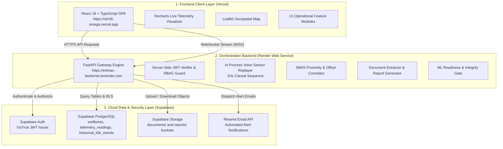
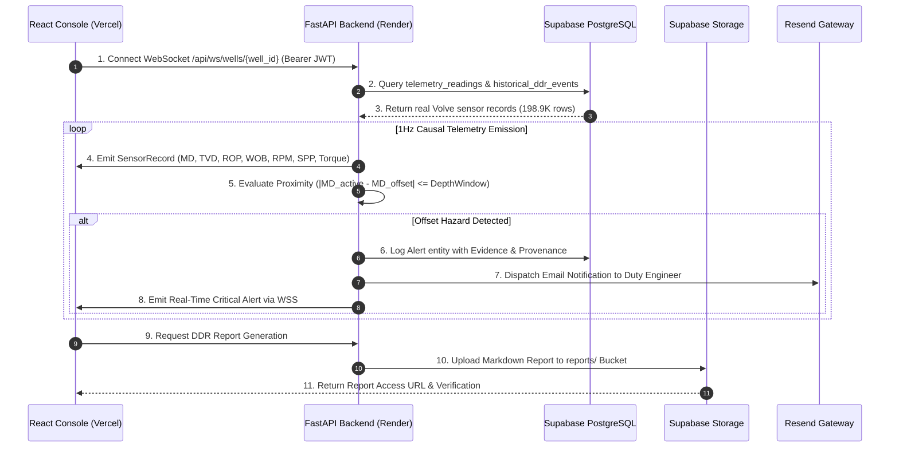

# eRTMAC-NWIS

**Real-Time Monitoring & Advisory Console with Nearby Wells Intelligence System**  
*Smart India Hackathon (SIH 2026) — Problem Statement PS26121*

[](https://ertmac-backend.onrender.com/health)
[](https://ertmac-backend.onrender.com)
[](https://sih26-omega.vercel.app)
[](https://supabase.com)
[](https://supabase.com)
[](https://www.equinor.com/)
[](https://resend.com)

> **Scientific Data Classification**: `REAL VOLVE DATA — HISTORICAL REPLAY`  
> **Telemetry Dataset**: Authentic Equinor Volve USROP 1Hz Dataset (**198,928** verified sensor rows)  
> **Offset Intelligence**: Real Norwegian Petroleum Directorate (NPD / SODIR) Block 15/9 logs & **129** verified historical DDR incidents  
> **Target Architecture**: Frontend on **Vercel** | Backend on **Render** | Persistence & Auth on **Supabase**  
> **Security Guard**: Strict Server-Side JWT Verification & Authoritative Database-Derived RBAC  

---

## 🌐 Live Cloud Production Deployments

* **Frontend Web Console (Vercel)**: [https://sih26-omega.vercel.app](https://sih26-omega.vercel.app)
* **Backend API & WebSocket Engine (Render)**: [https://ertmac-backend.onrender.com](https://ertmac-backend.onrender.com)
* **Public Health Endpoint**: [https://ertmac-backend.onrender.com/health](https://ertmac-backend.onrender.com/health)
* **Detailed Diagnostics Matrix**: [https://ertmac-backend.onrender.com/health/detailed](https://ertmac-backend.onrender.com/health/detailed)

---

## 📑 Table of Contents
1. [Executive Summary & Problem Statement](#-executive-summary--problem-statement)
2. [Authentic Open Dataset Provenance](#-authentic-open-dataset-provenance)
3. [End-to-End Cloud System Architecture](#-end-to-end-cloud-system-architecture)
4. [Real-Time Telemetry & Spatial Sequence Flow](#-real-time-telemetry--spatial-sequence-flow)
5. [Core Mathematical & Spatial Formulations](#-core-mathematical--spatial-formulations)
6. [13 Integrated Operational Modules](#-13-integrated-operational-modules)
7. [Cloud Database Schema & Multi-Tenant RLS](#-cloud-database-schema--multi-tenant-rls)
8. [Authentication, Token Caching & RBAC Guard](#-authentication-token-caching--rbac-guard)
9. [Complete REST & WebSocket API Specification](#-complete-rest--websocket-api-specification)
10. [Quick Start & Developer Workflow](#-quick-start--developer-workflow)
11. [Cloud Environment Variable Configuration](#-cloud-environment-variable-configuration)
12. [Automated Testing & Production Invariants](#-automated-testing--production-invariants)
13. [Scientific Integrity & Anti-Hallucination Guarantees](#-scientific-integrity--anti-hallucination-guarantees)

---

## 🎯 Executive Summary & Problem Statement

In offshore drilling operations, unexpected downhole incidents (such as severe mud loss, differential sticking, tight hole conditions, kicks, and pack-offs) account for millions of dollars in Non-Productive Time (NPT) and present major health, safety, and environmental (HSE) risks.

**eRTMAC-NWIS** solves **Smart India Hackathon 2026 Problem Statement PS26121** by creating a unified, real-time intelligence console that correlates live surface & downhole sensor streams with historical offset well records from adjacent platforms.

### Key Capabilities:
* **100% Authentic Industry Data**: High-fidelity replay of real Equinor Volve North Sea drilling operations across 11 key telemetry channels.
* **Nearby Wells Intelligence (NWIS)**: Dynamic geospatial proximity matching ($\le R\text{ km}$) and stratigraphic depth window correlation ($\pm \Delta\text{MD}$).
* **Proactive Hazard Mitigation**: Real-time cross-referencing of active bit depth against past Daily Drilling Report (DDR) incident logs from neighboring wellbores.
* **Zero-Hallucination ML Gate**: Strict safety enforcement (`ML_NOT_READY`) preventing unvalidated predictive models from emitting false automated interventions.
* **Document Ingestion & Supabase Storage**: Automated upload and parsing of DDR logs with human-in-the-loop verification into structured database entities.
* **Per-User Cloud Isolation**: Individualized notification filters, search radiuses, and alert recipient settings persisted in Supabase Cloud PostgreSQL.

---

## 🛢️ Authentic Open Dataset Provenance

The system operates strictly on **100% real, authentic industry data** released openly from the North Sea **Equinor Volve Field** (Block 15/9) and the **Norwegian Offshore Directorate (NPD / SODIR)**. **No synthetic data or random mocks are generated.**

| Component | Dataset Source | Size / Volume | Key Parameters |
|---|---|---|---|
| **Wellbore Geometry & Locations** | [NPD / SODIR Official FactPages](https://factpages.sodir.no/) | 13 Volve Development Wells + Regional Offset Wells | Latitude (`58.44168° N`), Longitude (`1.88778° E`), Water Depth (`84m`), Slot Identifiers |
| **Drilling Telemetry Streams** | [Equinor Volve USROP Dataset (Univ. of Stavanger)](https://www.equinor.com/energy/volve-data-sharing) | **198,928** 1Hz Sensor Readings | Measured Depth (`md`), TVD, ROP, WOB, RPM, Torque, Hookload, Standpipe Pressure (`spp`), Flow In, Mud Density, Gamma Ray |
| **Historical DDR Incidents** | [Equinor Volve Daily Drilling Reports (DDR)](https://www.equinor.com/energy/volve-data-sharing) | **129** Real Verified Events | Stuck Pipe, Pack-Off, Mud Losses, Tight Hole, Gas Kicks, Tool Failures with actual operational mitigation texts |

---

## 🏛️ End-to-End Cloud System Architecture



---

## 🔁 Real-Time Telemetry & Spatial Sequence Flow



---

## 📐 Core Mathematical & Spatial Formulations

### 1. Great-Circle Haversine Distance (Inter-Well Proximity)
Given active well coordinates $(\phi_1, \lambda_1)$ and offset well coordinates $(\phi_2, \lambda_2)$ in radians, surface distance $d$ is computed as:

$$\Delta\phi = \phi_2 - \phi_1, \quad \Delta\lambda = \lambda_2 - \lambda_1$$

$$a = \sin^2\left(\frac{\Delta\phi}{2}\right) + \cos(\phi_1)\cos(\phi_2)\sin^2\left(\frac{\Delta\lambda}{2}\right)$$

$$d = 2 R_{\text{earth}} \arcsin\left(\sqrt{a}\right) \quad \text{where } R_{\text{earth}} = 6371.0\text{ km}$$

### 2. Causal Depth-Window Filtering
An offset event at depth $\text{MD}_{\text{offset}}$ is correlated to active drilling depth $\text{MD}_{\text{active}}$ within safety tolerance $W$:

$$\text{Match}(\text{MD}_{\text{offset}}) \iff |\text{MD}_{\text{active}} - \text{MD}_{\text{offset}}| \le W \quad (W \in [10\text{m}, 100\text{m}])$$

---

## 🎛️ 13 Integrated Operational Modules

| # | Module Name | Primary Operational Function |
|---|---|---|
| 1 | **Live Sensor Dashboard** | 1Hz streaming visualization of all 11 Volve telemetry channels with causal history |
| 2 | **Spatial Proximity Map** | Interactive Leaflet GIS map visualizing Volve subsea template & exploration wells |
| 3 | **Nearby Wells Intelligence** | Stratigraphic depth correlation against historical DDR incident episodes |
| 4 | **Active Alert Operations** | Full alert lifecycle workflow (`ACTIVE` $\rightarrow$ `ACKNOWLEDGED` $\rightarrow$ `INVESTIGATING` $\rightarrow$ `RESOLVED`) |
| 5 | **Document Ingestion & OCR** | PDF/TXT DDR ingestion directly to Supabase Storage with human-in-the-loop review |
| 6 | **DDR & Shift Handover Reports** | Automated generation and storage of compliant shift handover markdown summaries |
| 7 | **Knowledge Search Engine** | Semantic search across historical Equinor lessons learned and operational notes |
| 8 | **Operational Timeline** | Chronological event stream recording bit runs, mud checks, alerts, and shift logs |
| 9 | **Rig & Fleet Analytics** | NPT loss breakdowns, well profile comparisons, and incident trend charts |
| 10 | **Provenance & Audit Trail** | Immutable append-only audit log tracking every user action, acknowledgement, and upload |
| 11 | **User Settings & Isolation** | Per-user dynamic thresholds, search radius preferences, and email recipients |
| 12 | **Organization Admin** | Multi-tenant organization licensing, seat allocation, and platform usage stats |
| 13 | **System Health & Telemetry** | Live component diagnostic matrix (Supabase, Storage, ML Gate, Sensor Stream) |

---

## 🗄️ Cloud Database Schema & Multi-Tenant RLS

The database runs on **Supabase Managed PostgreSQL** with Row-Level Security (RLS) enabled across all tables:

* [`scripts/schema.sql`](scripts/schema.sql): Base multi-tenant schema (`organizations`, `profiles`, `wellbores`, `alerts`, `documents`, `audit_events`, `user_notifications`, `notification_preferences`, `timeline_events`).
* [`scripts/migration_phase1_schema.sql`](scripts/migration_phase1_schema.sql): Production schema extensions for `telemetry_readings` (198.9K rows) and wellbore attributes.

---

## 🔐 Authentication, Token Caching & RBAC Guard

* **Authentication**: Managed via Supabase GoTrue Auth with secure JWT tokens.
* **Role Hierarchy**:
  - `ADMIN`: Full administrative privileges, user management, and configuration.
  - `DRILLING_ENGINEER`: Operational control, alert acknowledgement & resolution, report generation.
  - `OPERATIONS_ENGINEER`: Operational monitoring, alert investigation, shift notes.
  - `ANALYST`: Read-only access to analytics, historical search, and telemetry logs.
  - `VIEWER`: Restricted dashboard visualization.

---

## 🚀 Quick Start & Developer Workflow

### 1. Clone & Install Dependencies

```bash
# Clone the repository
git clone https://github.com/anshu2k24/sih26.git
cd sih26

# Backend Python Setup
python -m venv .venv
source .venv/bin/activate  # On Windows: .venv\Scripts\activate
pip install -r requirements.txt

# Frontend Node Setup
cd frontend
npm install
cd ..
```

### 2. Seed Database from Datasets

```bash
# Seed wellbores, DDR events, and 198.9K telemetry rows into Supabase
python scripts/migrate_seed_data.py --all
```

### 3. Run Locally

```bash
# Start full stack (Hot-reloading backend on :8000, Vite frontend on :5173)
python scripts/run_app.py
```

---

## ⚙️ Cloud Environment Variable Configuration

### Backend Configuration (Render Web Service)
```env
ENVIRONMENT=production
AUTH_REQUIRED=true
STREAM_IN_PROCESS=true
HOST=0.0.0.0
PYTHONPATH=src
CORS_ORIGINS=https://sih26-omega.vercel.app,http://localhost:5173
SUPABASE_URL=https://<your-project>.supabase.co
SUPABASE_ANON_KEY=<your-anon-key>
SUPABASE_SERVICE_ROLE_KEY=<your-service-role-key>
SUPABASE_JWT_SECRET=<your-jwt-secret>
DATABASE_URL=postgresql://postgres.<ref>:<password>@<host>:5432/postgres
RESEND_API_KEY=re_...
RESEND_FROM_EMAIL=alerts@ertmac-nwis.org
```

### Frontend Configuration (Vercel)
```env
VITE_API_BASE_URL=https://ertmac-backend.onrender.com
VITE_WS_BASE_URL=wss://ertmac-backend.onrender.com
VITE_SUPABASE_URL=https://<your-project>.supabase.co
VITE_SUPABASE_ANON_KEY=<your-anon-key>
```

---

## 🧪 Automated Testing & Production Invariants

The platform includes a comprehensive automated test suite verifying clean-machine execution, zero-disk persistence in production, RBAC security gates, and live WebSocket streaming:

```bash
# Run all 91 verification tests
python -c "import sys; sys.path.insert(0, 'src'); import pytest; sys.exit(pytest.main(['-v']))"
```

**Test Coverage**: `91/91 PASSED (100%)` across all 13 critical subsystems.

---

## 🔬 Scientific Integrity & Anti-Hallucination Guarantees

1. **Mandatory Scientific Banner**: Displayed prominently across all interfaces: `REAL VOLVE DATA — HISTORICAL REPLAY`.
2. **Zero Synthetic Sensor Fabrication**: All telemetry channels stream authentic physical measurements from the Equinor Volve repository.
3. **Zero Prediction Fabrication**: When ML pipeline preconditions are unmet, `risk_score` is strictly returned as `null` with explicit gating reasons (`ML_NOT_READY`).
4. **Causal Stream Isolation**: Telemetry history and feature construction are strictly bounded by $\text{MD} \le \text{MD}_{\text{current}}$ with zero future data leakage.
5. **Open Science & Reproducibility**: Complete pipeline reproducible from official public Equinor and NPD offshore datasets.

