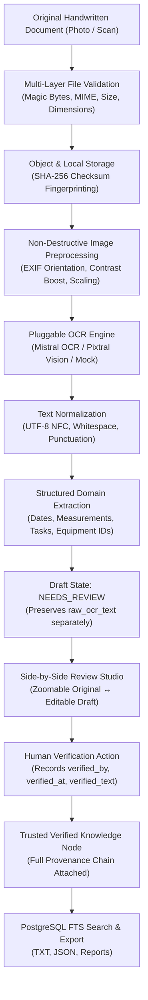
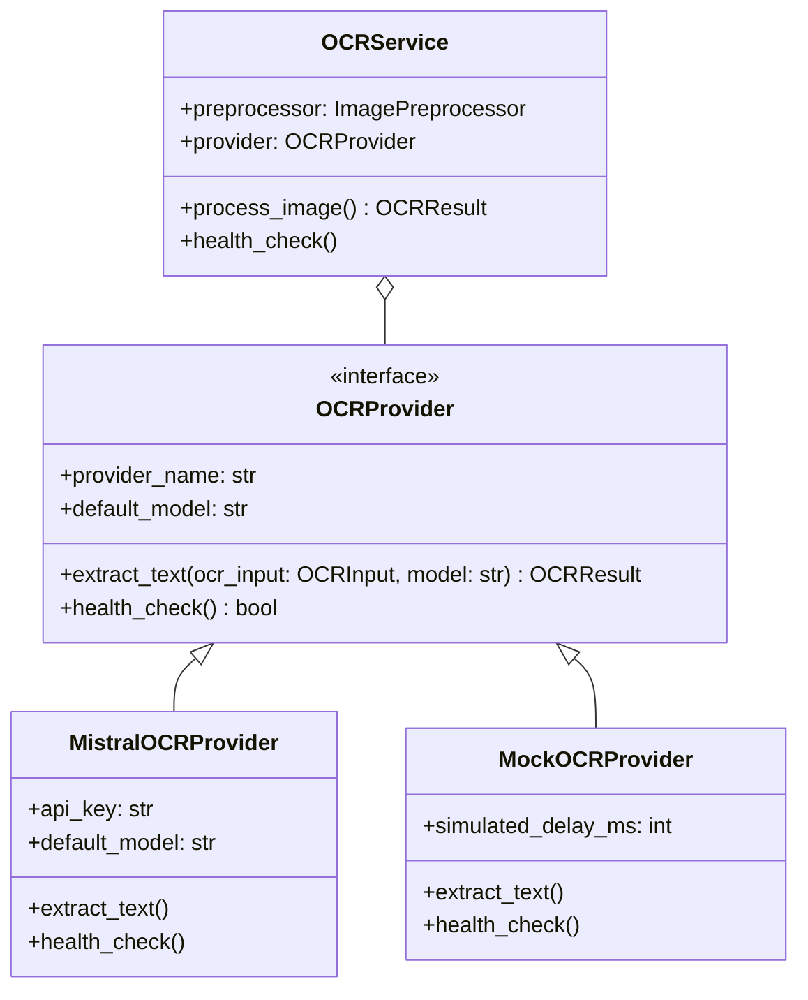

# SIH 2026 PS121 — Handwritten Notes OCR & Ingestion Architecture

## 1. Executive Summary

This module implements a production-grade **Handwritten Notes OCR & Intelligent Document Ingestion System** for **Smart India Hackathon 2026 (Problem Statement PS121)**.

### Core Operating Axiom
> **"OCR output is a DRAFT. Human verification makes it TRUSTED DATA."**

The system preserves the original handwritten document image, maintains an immutable provenance record, supports pluggable OCR providers (Mistral OCR / Pixtral Vision, Mock demo provider), extracts domain entities (measurements, dates, tasks, equipment IDs), and provides a side-by-side human review studio.

---

## 2. End-to-End Ingestion Pipeline

---

## 3. Modular OCR Provider Abstraction

The system decouples business logic from specific OCR models via the `OCRProvider` interface:

### Supported Providers:
1. **Mistral AI (`mistral`)**:
   - `mistral-ocr-latest`: Dedicated document and handwriting OCR API.
   - `pixtral-12b-2409`: Multimodal vision LLM providing resilient transcriptions for challenging handwriting.
2. **Mock Provider (`mock`)**:
   - Deterministic offline provider for CI tests, development, and offline demo environments (`OCR_PROVIDER=mock`).

---

## 4. Provenance & Auditability Model

Every verified note maintains a four-tier traceable chain:

1. **Source Document**: Preserved file at `data/notes_images/` with SHA-256 hash.
2. **OCR Run History**: Immutable record in `ocr_runs` table tracking attempt count, provider, model, latency, and machine draft.
3. **Machine Draft**: `raw_ocr_text` preserved permanently and never overwritten.
4. **Human Verification**: `verified_text`, `verified_by` (User ID / Profile), and `verified_at` timestamp.

---

## 5. Security & RBAC Matrix

| Role | View Notes | Upload & OCR | Edit Draft | Verify & Promote | Delete Note |
| :--- | :---: | :---: | :---: | :---: | :---: |
| **ADMIN** | Yes | Yes | Yes | Yes | Yes |
| **DRILLING_ENGINEER** | Yes | Yes | Yes | Yes | Yes |
| **OPERATIONS_ENGINEER** | Yes | Yes | Yes | Yes | Yes |
| **ANALYST** | Yes | Yes | Yes | No | No |
| **VIEWER** | Yes | No | No | No | No |
